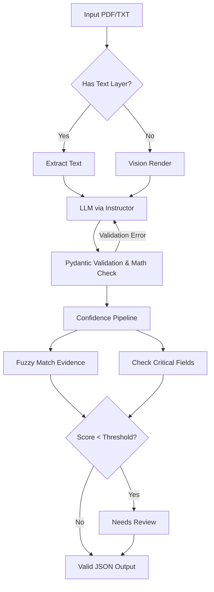

# Change Order Extraction Pipeline

A working prototype for extracting structured fields from messy Change Order documents (PDFs and text) into validated JSON, built with Python, PyMuPDF, Pydantic, and Instructor + OpenAI.

## What it Does
- **Ingests** PDFs and raw text.
- **Extracts** structured data using LLM reasoning (GPT-4o).
- **Validates** mathematically using Pydantic (e.g. sums of line items must match the total).
- **Scores** confidence field-by-field, combining LLM self-reflection with deterministic "evidence grounding" (fuzzy matching the text snippet back to the source document).
- **Flags** extractions for human review if confidence falls below a threshold or if math/evidence checks fail.
- **Vision Fallback**: Automatically renders scanned PDFs with no text layer into images to use vision models.

## Architecture


## Quickstart

1. Install dependencies:
```bash
pip install -r requirements.txt
```

2. Set your OpenAI API key:
```bash
# In .env file, or via shell:
export OPENAI_API_KEY="sk-..."
```

3. Run extraction on a document and visualize the evidence:
```bash
python main.py samples/clean_co.pdf --out output.json --visualize output_highlighted.pdf
```

## Running Tests & Evaluation

To run the unit tests (no API key required):
```bash
pytest
```

To run the full evaluation suite against the synthetic samples (API key required):
```bash
python scripts/evaluate.py
```
This script runs the pipeline on `clean_co.pdf`, `messy_co.pdf`, and `mismatch_co.pdf`, compares the results against the expected JSON, and prints an accuracy table.

## Project Structure
- `schema.py`: Strict Pydantic models with `ExtractedField` for value, confidence, and evidence.
- `extractor.py`: LLM orchestration with PyMuPDF and Instructor.
- `confidence.py`: The deterministic and heuristic scoring pipeline.
- `main.py`: CLI.
- `tests/`: Pytest suite covering math validation, evidence grounding, and vision fallback.
- `scripts/`: Sample generation and evaluation scripts.
